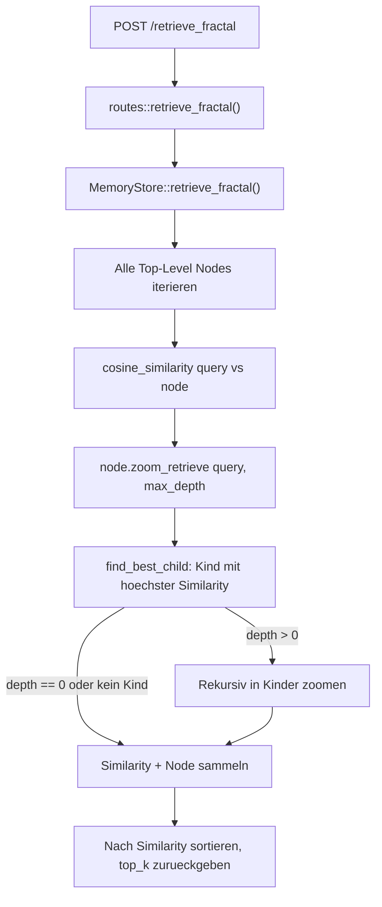
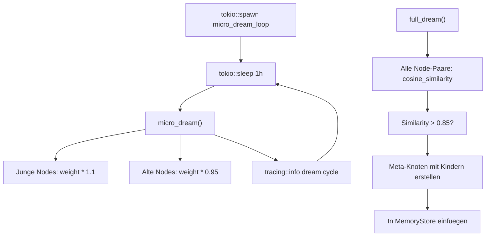

# Woche 1: Fraktales Zoomen + erster Dream Mode

## Aktueller Stand (Woche 0 abgeschlossen)

- `FractalNode` mit `children: Vec<FractalNode>` bereits vorhanden aber unbenutzt
- `MemoryStore` hat `insert/get/list_all/count` -- es fehlt `update_node` fuer Dream Mode
- 4 Routen: `/health`, `/store_session`, `/store_external`, `/retrieve/{id}`
- 4 gruene Tests
- Keine Dependencies muessen hinzugefuegt werden (alles vorhanden)

---

## Datenfluss: Fraktales Retrieval




## Datenfluss: Dream Mode




---

## Task 1: Fraktales Zoomen in `fractal_node.rs`

In `[src/memory/fractal_node.rs](src/memory/fractal_node.rs)` drei neue Methoden im `impl FractalNode` Block:

`**cosine_similarity**` -- freie Funktion, nicht auf self:

```rust
pub fn cosine_similarity(a: &[f32], b: &[f32]) -> f32 {
    let dot: f32 = a.iter().zip(b).map(|(x, y)| x * y).sum();
    let mag_a: f32 = a.iter().map(|x| x * x).sum::<f32>().sqrt();
    let mag_b: f32 = b.iter().map(|x| x * x).sum::<f32>().sqrt();
    if mag_a == 0.0 || mag_b == 0.0 { return 0.0; }
    dot / (mag_a * mag_b)
}
```

`**find_best_child**` -- gibt das Kind mit der hoechsten Cosine Similarity zurueck:

```rust
pub fn find_best_child(&self, query_vector: &[f32]) -> Option<&FractalNode> {
    self.children.iter()
        .max_by(|a, b| {
            let sim_a = cosine_similarity(&a.vector, query_vector);
            let sim_b = cosine_similarity(&b.vector, query_vector);
            sim_a.partial_cmp(&sim_b).unwrap_or(std::cmp::Ordering::Equal)
        })
}
```

`**zoom_retrieve**` -- rekursives Zoomen, sammelt (similarity, node) Paare:

```rust
pub fn zoom_retrieve(&self, query_vector: &[f32], max_depth: usize) -> Vec<(f32, FractalNode)> {
    let sim = cosine_similarity(&self.vector, query_vector);
    let mut results = vec![(sim, self.clone())];
    if max_depth > 0 {
        if let Some(best) = self.find_best_child(query_vector) {
            results.extend(best.zoom_retrieve(query_vector, max_depth - 1));
        }
    }
    results
}
```

---

## Task 2: `retrieve_fractal` + `update_node` in `in_memory.rs`

In `[src/storage/in_memory.rs](src/storage/in_memory.rs)`:

`**update_node**` -- noetig fuer Dream Mode, aktualisiert einen Node in-place:

```rust
pub async fn update_node<F>(&self, id: &Uuid, updater: F) -> Result<()>
where F: FnOnce(&mut FractalNode)
{
    let mut nodes = self.nodes.write().await;
    if let Some(node) = nodes.get_mut(id) {
        updater(node);
    }
    Ok(())
}
```

`**retrieve_fractal**` -- iteriert alle Nodes, zoomt fraktal, gibt top_k zurueck:

```rust
pub async fn retrieve_fractal(
    &self, query_vector: &[f32], top_k: usize, max_depth: usize,
) -> Vec<FractalNode> {
    let nodes = self.nodes.read().await;
    let mut scored: Vec<(f32, FractalNode)> = nodes.values()
        .flat_map(|node| node.zoom_retrieve(query_vector, max_depth))
        .collect();
    scored.sort_by(|a, b| b.0.partial_cmp(&a.0).unwrap_or(std::cmp::Ordering::Equal));
    scored.into_iter().take(top_k).map(|(_, node)| node).collect()
}
```

Import fuer `cosine_similarity` aus dem memory-Modul hinzufuegen.

---

## Task 3: `src/memory/dream.rs` (neue Datei)

Neue Datei `[src/memory/dream.rs](src/memory/dream.rs)`:

- `**DreamMode**` Struct haelt einen `MemoryStore` (bereits Arc-basiert, kein extra Arc noetig)
- `**micro_dream()**`: Iteriert alle Nodes, boostet junge (< 24h) mit `weight * 1.1`, decayed alte mit `weight * 0.95`
- `**full_dream()**`: Holt alle Nodes, berechnet paarweise Cosine Similarity, bei > 0.85 erstellt Meta-Knoten mit beiden als Kinder
- `**micro_dream_loop()**`: Endlosschleife mit `tokio::time::sleep(Duration::from_secs(3600))`
- `**status()**`: Gibt DreamStatus zurueck (last_run, cycle_count)

`DreamMode` braucht `Arc<RwLock<...>>` fuer `last_run` und `cycle_count` um aus dem Loop heraus zu aktualisieren.

Export in `[src/memory/mod.rs](src/memory/mod.rs)`: `pub mod dream;` und re-export.

---

## Task 4: API-Endpoints in `routes.rs`

In `[src/api/routes.rs](src/api/routes.rs)`:

- `**POST /retrieve_fractal**`: Nimmt `{ query_vector, top_k, max_depth }` entgegen, ruft `store.retrieve_fractal()` auf
- `**GET /dream/status**`: Gibt DreamStatus (last_run, cycle_count) als JSON zurueck

Problem: `/dream/status` braucht Zugriff auf `DreamMode`, nicht nur auf `MemoryStore`. Loesung: Einen neuen `**AppState**` struct erstellen, der `MemoryStore` und `DreamMode` enthaelt, und den als Axum-State verwenden. Das erfordert Aenderungen an allen bestehenden Handler-Signaturen (State-Extraktion).

---

## Task 5: main.rs Integration

In `[src/main.rs](src/main.rs)`:

- `AppState` erstellen mit `MemoryStore` + `DreamMode`
- `tokio::spawn(dream_mode.micro_dream_loop())` starten
- Neue Routen: `POST /retrieve_fractal` und `GET /dream/status`
- Alle bestehenden Routen behalten, `.with_state(app_state)` statt `.with_state(store)`

---

## Task 6: Tests erweitern

In `[src/memory/tests.rs](src/memory/tests.rs)` neue Tests:

- `cosine_similarity_identical_vectors` -- erwartet 1.0
- `cosine_similarity_orthogonal_vectors` -- erwartet 0.0
- `zoom_retrieve_with_children` -- Node mit Kindern, zoomt korrekt
- `retrieve_fractal_top_k` -- via MemoryStore, gibt korrekte Anzahl zurueck

---

## Task 7: Verifikation

- `cargo check` + `cargo test` (alle Tests gruen)
- Server starten mit `cargo run`
- curl POST `/store_session` (einige Nodes mit aehnlichen Vektoren)
- curl POST `/retrieve_fractal` mit Query-Vektor
- curl GET `/dream/status`

---

## Dateiaenderungen (Zusammenfassung)

- **Edit**: `src/memory/fractal_node.rs` -- cosine_similarity, find_best_child, zoom_retrieve
- **Edit**: `src/storage/in_memory.rs` -- update_node, retrieve_fractal
- **Neu**: `src/memory/dream.rs` -- DreamMode struct + micro/full dream
- **Edit**: `src/memory/mod.rs` -- export dream module
- **Edit**: `src/api/routes.rs` -- retrieve_fractal endpoint, dream_status endpoint, AppState
- **Edit**: `src/main.rs` -- AppState, DreamMode spawn, neue Routen
- **Edit**: `src/memory/tests.rs` -- 4 neue Tests
- Keine neuen Dependencies noetig
