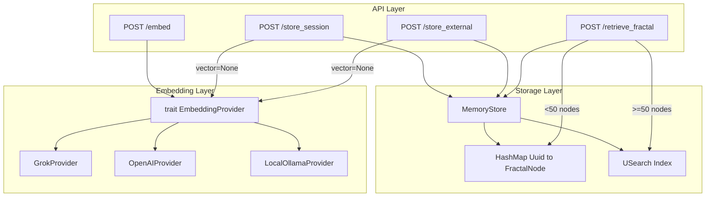

# Woche 2: Embedding-Provider + USearch-Index

## Ausgangslage

- `usearch = "2.23"` ist bereits in [Cargo.toml](Cargo.toml), aber nirgends verwendet
- [src/embedding/mod.rs](src/embedding/mod.rs) ist ein leerer Placeholder
- `vector` ist in `StoreSessionRequest` / `StoreExternalRequest` aktuell Pflichtfeld
- Kein async Trait Support vorhanden -- wir brauchen `async-trait` als neue Dependency

## Neue Dependencies in Cargo.toml

- `async-trait = "0.1"` -- fuer async Trait-Methoden mit dyn dispatch
- `reqwest = { version = "0.12", features = ["json"] }` -- HTTP-Client fuer Grok/OpenAI API-Calls

## Schritt 1: Embedding Provider Trait + Implementierungen

**Neue Datei: [src/embedding/provider.rs](src/embedding/provider.rs)**

```rust
#[async_trait::async_trait]
pub trait EmbeddingProvider: Send + Sync {
    async fn embed(&self, text: &str) -> anyhow::Result<Vec<f32>>;
    fn dimension(&self) -> usize;
    fn name(&self) -> &str;
}
```

Drei Implementierungen:

- `**GrokProvider**`: `api_key: String`, `client: reqwest::Client`. Ruft `https://api.x.ai/v1/embeddings` mit Model `grok-2-embed` auf. Dimension 1536.
- `**OpenAIProvider**`: `api_key: String`, `client: reqwest::Client`. Ruft `https://api.openai.com/v1/embeddings` mit Model `text-embedding-3-small` auf. Dimension 1536.
- `**LocalOllamaProvider**`: Placeholder, gibt einen normalisierten Pseudo-Vektor zurueck (Hash-basiert, deterministisch). Kein externer Call. Dimension 384. Spaeter echtes Ollama.

Jede Struct bekommt `fn new(...)` Constructor.

## Schritt 2: Embedding Registry

**Umschreiben: [src/embedding/mod.rs](src/embedding/mod.rs)**

```rust
pub mod provider;
pub use provider::{EmbeddingProvider, GrokProvider, OpenAIProvider, LocalOllamaProvider};

pub enum ProviderKind { Grok, OpenAI, LocalOllama }

pub fn create_provider(kind: ProviderKind, api_key: Option<String>) -> Arc<dyn EmbeddingProvider>
```

Factory-Pattern: je nach `ProviderKind` und vorhandenem API-Key wird der richtige Provider instanziiert. Fallback auf `LocalOllamaProvider` wenn kein Key.

## Schritt 3: USearch-Index in MemoryStore

**Erweitern: [src/storage/in_memory.rs](src/storage/in_memory.rs)**

```rust
pub struct MemoryStore {
    nodes: Arc<RwLock<HashMap<Uuid, FractalNode>>>,
    usearch_index: Arc<Mutex<Option<usearch::Index>>>,
    uuid_to_key: Arc<RwLock<HashMap<Uuid, u64>>>,
    next_key: Arc<AtomicU64>,
}
```

Aenderungen:

- `**insert()**`: Beim ersten Insert mit nicht-leerem Vektor wird der USearch-Index lazy initialisiert (`Index::new(MetricKind::Cos, ScalarKind::F32, dimension)`). Danach `index.add(key, &vector)`. UUID-zu-USearch-Key Mapping in `uuid_to_key`.
- `**retrieve_fractal()**`: Hybrid-Strategie:
  - Weniger als 50 Nodes ODER kein USearch-Index: Fallback auf bestehendes fraktales Zoomen (wie bisher)
  - Ab 50 Nodes: USearch `search(query, top_k * 2)` fuer Pre-Filtering, dann fraktales Zoomen nur auf Kandidaten
- `**remove_from_index()**`: Hilfsmethode fuer spaetere Cleanup-Operationen

## Schritt 4: API-Erweiterungen

**Erweitern: [src/api/routes.rs](src/api/routes.rs)**

### 4a. Neue Route: `POST /embed`

```rust
#[derive(Deserialize)]
pub struct EmbedRequest { pub text: String }

#[derive(Serialize)]
pub struct EmbedResponse { pub vector: Vec<f32>, pub dimension: usize, pub provider: String }
```

Nimmt Text, ruft `state.embedding.embed(text)` auf, gibt Vektor zurueck.

### 4b. `vector` wird optional in Store-Requests

```rust
pub struct StoreSessionRequest {
    pub content: String,
    pub vector: Option<Vec<f32>>,  // war: Vec<f32>
    pub metadata: HashMap<String, Value>,
}

pub struct StoreExternalRequest {
    pub pointer: String,
    pub vector: Option<Vec<f32>>,  // war: Vec<f32>
    pub metadata: HashMap<String, Value>,
}
```

Logik in `store_session()` und `store_external()`:

- Wenn `vector` vorhanden: direkt verwenden
- Wenn `vector` fehlt: automatisch via `state.embedding.embed(content/pointer)` generieren
- Bei externem Pointer ohne Text: Fehler zurueckgeben wenn kein Vektor und kein einbettbarer Text

### 4c. AppState erweitern

```rust
pub struct AppState {
    pub store: MemoryStore,
    pub dream: DreamMode,
    pub embedding: Arc<dyn EmbeddingProvider>,
}
```

## Schritt 5: main.rs anpassen

**Erweitern: [src/main.rs](src/main.rs)**

- `GROK_API_KEY` aus `std::env::var()` lesen
- Fallback-Kette: Grok (wenn Key da) -> OpenAI (wenn Key da) -> LocalOllama
- Provider als `Arc<dyn EmbeddingProvider>` in `AppState`
- Neue Route `.route("/embed", post(routes::embed_text))` registrieren
- Log welcher Provider aktiv ist

## Schritt 6: Tests erweitern

**Erweitern: [src/memory/tests.rs](src/memory/tests.rs)** -- 3 neue Tests:

1. `**test_local_ollama_embedding`**: LocalOllamaProvider erstellen, `.embed("test")` aufrufen, pruefen dass Vektor korrekte Dimension hat und normalisiert ist
2. `**test_store_session_auto_embed`**: Session ohne Vektor via MemoryStore + Provider speichern, pruefen dass Node einen Vektor hat
3. `**test_usearch_retrieve_consistency`**: 20+ Nodes mit bekannten Vektoren einfuegen, USearch-Retrieve soll gleiche Top-Ergebnisse liefern wie fraktales Zoomen

## Schritt 7: Validierung

- `cargo check` -- Kompilierung
- `cargo test` -- alle Tests gruen
- Server starten, curl-Tests:
  - `POST /embed` mit `{"text": "hello world"}`
  - `POST /store_session` ohne `vector` Feld
  - `POST /store_session` mit `vector` Feld (Backward-Kompatibilitaet)

## Architektur-Diagramm




## Risiken und Mitigationen

- **USearch Thread-Safety**: `usearch::Index` ist nicht `Send+Sync` by default. Wrapping in `Arc<Mutex<>>` loest das.
- **USearch Dimension-Mismatch**: Lazy-Init beim ersten Insert fixiert die Dimension. Spaetere Inserts mit anderer Dimension werden abgelehnt.
- **API-Key fehlt**: Graceful Fallback auf LocalOllamaProvider mit Log-Warning.

