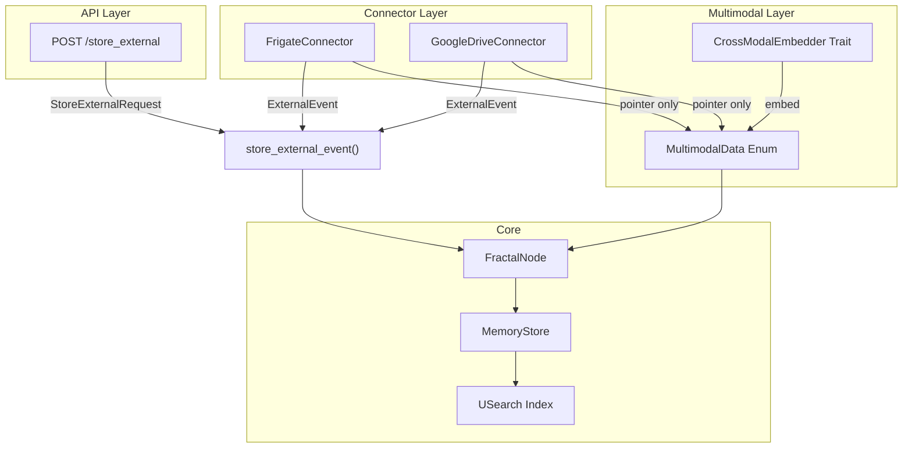

# Woche 3: Multimodal Support + Externe Connectoren

## Ausgangslage

- FractalNode hat `content: Option<String>` (Sessions) und `original_pointer: Option<String>` (Externe) - Pointer-First funktioniert
- USearch + Embedding-Provider (Grok/OpenAI/LocalOllama) sind stabil
- Kein `src/connectors/` Verzeichnis vorhanden
- Kein `src/multimodal.rs` vorhanden
- Tests in [src/memory/tests.rs](src/memory/tests.rs) (11 Tests, alle gruen)

## Schritt 1: Multimodal-Modul

**Neue Datei: `src/multimodal.rs`**

```rust
#[derive(Debug, Clone, Serialize, Deserialize)]
#[serde(tag = "type")]
pub enum MultimodalData {
    Image { pointer: String, embedding: Vec<f32> },
    Audio { pointer: String, embedding: Vec<f32> },
    Sensor { data: serde_json::Value, embedding: Vec<f32> },
}

#[async_trait]
pub trait CrossModalEmbedder: Send + Sync {
    fn cross_embed(&self, data: &MultimodalData) -> Vec<f32>;
}

pub struct PlaceholderCrossModalEmbedder;
```

- `MultimodalData` ist `serde(tag = "type")` fuer sauberes JSON: `{"type": "Image", "pointer": "...", "embedding": [...]}`
- `CrossModalEmbedder::cross_embed` gibt als Placeholder das Embedding der jeweiligen Variante zurueck (spaeter: Average ueber Modalitaeten)
- Helper `MultimodalData::embedding()` fuer einheitlichen Zugriff auf den Embedding-Vektor

**Registrieren in `src/main.rs`:** `mod multimodal;`

## Schritt 2: FractalNode erweitern

**Aendern: [src/memory/fractal_node.rs](src/memory/fractal_node.rs)**

```rust
pub struct FractalNode {
    // ... bestehende Felder ...
    pub multimodal: Option<MultimodalData>,  // NEU
}
```

Aenderungen:

- Import `crate::multimodal::MultimodalData` hinzufuegen
- Feld `pub multimodal: Option<MultimodalData>` in FractalNode
- In `new_session()` und `new_external()`: `multimodal: None` setzen
- Neue Methode `new_external_multimodal(pointer, vector, metadata, multimodal)` fuer Connector-Events

## Schritt 3: store_external API erweitern

**Aendern: [src/api/routes.rs](src/api/routes.rs)**

```rust
#[derive(Deserialize)]
pub struct StoreExternalRequest {
    pub pointer: String,
    #[serde(default)]
    pub vector: Option<Vec<f32>>,
    #[serde(default)]
    pub metadata: HashMap<String, Value>,
    #[serde(default)]
    pub multimodal: Option<MultimodalData>,  // NEU
}
```

In `store_external()`:

- `multimodal` Feld aus Request extrahieren
- An `FractalNode` weiterreichen (neues Feld setzen oder via `new_external` + nachtraegliches Setzen)
- Falls `multimodal` vorhanden und `vector` fehlt: Embedding aus `MultimodalData` verwenden

## Schritt 4: Connectors-Modul

### 4a. ExternalEvent und Modul-Struktur

**Neue Datei: `src/connectors/mod.rs`**

```rust
pub mod frigate;
pub mod drive;

pub struct ExternalEvent {
    pub pointer: String,
    pub metadata: HashMap<String, Value>,
    pub multimodal: Option<MultimodalData>,
}
```

### 4b. Frigate-Connector

**Neue Datei: `src/connectors/frigate.rs`**

```rust
pub struct FrigateConnector {
    pub base_url: String,
    pub poll_interval: Duration,
}
```

- `async fn poll_events(&self) -> Result<Vec<ExternalEvent>>`: Placeholder, gibt Dummy-Events zurueck mit `pointer: "frigate://camera/front/event/{id}"` und `multimodal: Some(MultimodalData::Image { ... })`
- Spaeter: echte HTTP-Calls gegen Frigate-API oder Webhook-Listener
- Pointer-First: nur URL zum Snapshot, nie das Bild selbst

### 4c. Google Drive-Connector

**Neue Datei: `src/connectors/drive.rs`**

```rust
pub struct GoogleDriveConnector {
    pub watch_folder_id: Option<String>,
}
```

- `async fn poll_changes(&self) -> Result<Vec<ExternalEvent>>`: Placeholder mit Dummy-Daten
- Pointer-Format: `gdrive://file/{file_id}`
- Spaeter: Google Drive Changes API mit Push-Notifications

### 4d. Registrieren

In `src/main.rs`: `mod connectors;`

## Schritt 5: Connector-Manager in main.rs

**Aendern: [src/main.rs](src/main.rs)**

Neuer Abschnitt nach Dream-Mode-Start:

```rust
// Connector-Manager: Frigate Poller
let connector_store = state.store.clone();
let connector_embedding = state.embedding.clone();
tokio::spawn(async move {
    let frigate = FrigateConnector::new("http://frigate:5000".into());
    loop {
        match frigate.poll_events().await {
            Ok(events) => {
                for event in events {
                    // store_external_event Logik
                }
            }
            Err(e) => tracing::warn!("frigate poll error: {e}"),
        }
        tokio::time::sleep(Duration::from_secs(30)).await;
    }
});
```

- Shared Helper-Funktion `store_external_event(store, embedding, event)` die sowohl Route als auch Connector nutzen
- Diese Funktion kommt in `src/connectors/mod.rs` oder als Methode auf `MemoryStore`

## Schritt 6: Tests erweitern

**Aendern: [src/memory/tests.rs](src/memory/tests.rs)** - 3 neue Tests:

1. `**test_multimodal_image_node`**: Erstellt einen FractalNode mit `MultimodalData::Image`, prueft dass `multimodal` gesetzt ist und `original_pointer` korrekt, kein Content gespeichert
2. `**test_multimodal_audio_node`**: Erstellt einen FractalNode mit `MultimodalData::Audio`, prueft Embedding-Dimension und Pointer-Format
3. `**test_multimodal_sensor_node**`: Erstellt einen FractalNode mit `MultimodalData::Sensor` (JSON-Value), prueft Store + Retrieve Konsistenz

Alle Tests validieren Pointer-First: kein `content`, nur `original_pointer` + `multimodal`.

## Schritt 7: Validierung

1. `cargo check` - Kompilierung pruefen
2. `cargo test` - alle Tests (alte + 3 neue) gruen
3. Server starten (`cargo run`)
4. curl-Tests:
  - `POST /store_external` mit multimodalem Image-Event
  - `POST /store_external` mit Sensor-Event
  - `GET /retrieve/{id}` - multimodal Feld in Response pruefen
5. Wenn alles gruen: "WOCHE 3 ABGESCHLOSSEN"

## Architektur-Diagramm




## Dateien-Uebersicht (Neu/Geaendert)

- **NEU:** `src/multimodal.rs` - MultimodalData Enum + CrossModalEmbedder Trait
- **NEU:** `src/connectors/mod.rs` - ExternalEvent + store_external_event Helper
- **NEU:** `src/connectors/frigate.rs` - FrigateConnector
- **NEU:** `src/connectors/drive.rs` - GoogleDriveConnector
- **GEAENDERT:** `src/memory/fractal_node.rs` - multimodal Feld in FractalNode
- **GEAENDERT:** `src/memory/mod.rs` - Re-Export von MultimodalData falls noetig
- **GEAENDERT:** `src/api/routes.rs` - multimodal in StoreExternalRequest
- **GEAENDERT:** `src/main.rs` - `mod multimodal`, `mod connectors`, Connector-Manager spawn
- **GEAENDERT:** `src/memory/tests.rs` - 3 neue Multimodal-Tests

## Risiken und Mitigationen

- **Zirkulaere Abhaengigkeiten:** `multimodal.rs` als Top-Level-Modul, wird von `memory` und `connectors` importiert. Kein Zyklus, da `multimodal` selbst nichts aus diesen Modulen importiert.
- **Serde-Tag fuer Enum:** `#[serde(tag = "type")]` erfordert dass JSON ein `"type"` Feld hat. Klare Dokumentation in API-Spec.
- **Connector-Manager Lifetime:** Store und Embedding werden geklont (`Arc`), keine Ownership-Probleme.
- **Placeholder-Connectoren:** Dummy-Daten laufen nur einmal beim Start (oder im Intervall). Spaeter echte APIs / Webhooks.

