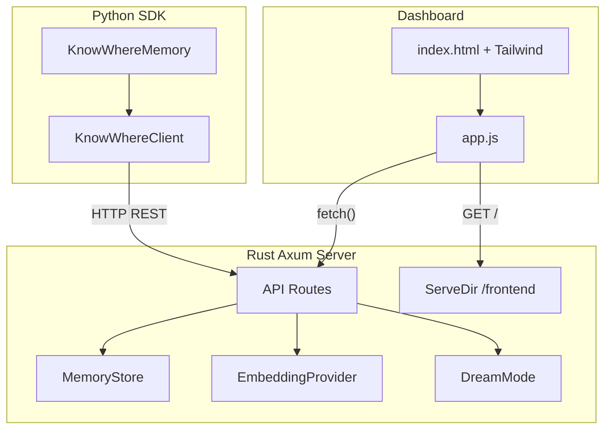

# Woche 4: Python-SDK + LangChain + Dashboard

## Aktueller Stand

- 7 API-Endpunkte aktiv: `/health`, `/embed`, `/store_session`, `/store_external`, `/retrieve/{id}`, `/retrieve_fractal`, `/dream/status`
- 14 Tests gruen (Basis, Embedding, Multimodal)
- Pointer-First durchgehend umgesetzt
- `sdk/python/` existiert bereits als leeres Verzeichnis

---

## 1. Python-SDK Grundgeruest

Erstelle die Paket-Struktur in `sdk/python/`:

```
sdk/python/
  pyproject.toml
  knowwhere/
    __init__.py
    client.py
  examples/
    langchain_example.py
```

**[sdk/python/pyproject.toml](sdk/python/pyproject.toml):** hatchling-basiert, Dependencies: `requests`, `pydantic>=2`, `langchain-core>=0.3`

**[sdk/python/knowwhere/init.py](sdk/python/knowwhere/__init__.py):** Exportiert `KnowWhereClient` und `KnowWhereMemory`

## 2. KnowWhereClient (sdk/python/knowwhere/client.py)

Klasse mit `base_url` + optionalem `api_key`. Methoden (alle async-faehig via `requests`):

- `store_session(content, metadata=None)` -- POST `/store_session`, gibt Node-ID zurueck
- `store_external(pointer, metadata=None, multimodal=None)` -- POST `/store_external`, Pointer-First
- `retrieve(node_id)` -- GET `/retrieve/{id}`
- `retrieve_fractal(query_vector, top_k=5, max_depth=3)` -- POST `/retrieve_fractal`
- `embed(text)` -- POST `/embed`, gibt Vektor zurueck
- `health()` -- GET `/health`
- `dream_status()` -- GET `/dream/status`

Request/Response-Modelle mit Pydantic v2 (`BaseModel`). Fehlerbehandlung mit eigenem `KnowWhereError`.

## 3. LangChain Memory Integration

In derselben Datei `client.py` (oder separate `memory.py`):

```python
class KnowWhereMemory(BaseMemory):
    client: KnowWhereClient
    memory_key: str = "history"

    @property
    def memory_variables(self) -> list[str]:
        return [self.memory_key]

    def load_memory_variables(self, inputs: dict) -> dict:
        # Embed query -> retrieve_fractal -> return context
        ...

    def save_context(self, inputs: dict, outputs: dict) -> None:
        # store_session mit Input+Output
        ...

    def clear(self) -> None:
        pass
```

Erbt von `langchain_core.memory.BaseMemory`. Nutzt `embed()` + `retrieve_fractal()` fuer kontextbasiertes Retrieval.

## 4. LangGraph-Beispiel

**[sdk/python/examples/langchain_example.py](sdk/python/examples/langchain_example.py):**

- Zeigt Initialisierung von `KnowWhereClient` und `KnowWhereMemory`
- Speichert eine Session, ruft sie via Fractal-Retrieval ab
- Demonstriert LangChain-Chain mit `KnowWhereMemory`
- Fallback: Laeuft auch ohne LLM-API-Key (nur SDK-Calls zeigen)

## 5. Dashboard (Vanilla JS + Tailwind)

Neue Dateien:

**[frontend/index.html](frontend/index.html):**

- Tailwind via CDN
- Modernes, dunkles UI (passend zu KnowWhere-Branding)
- Vier Sektionen:
  1. **Health-Status** -- Zeigt `/health` Response (Status + Node-Count)
  2. **Letzte Nodes** -- Tabelle/Cards der letzten gespeicherten Knoten (via `/retrieve_fractal` mit Nullvektor oder neuer Listing-Route)
  3. **Dream-Status** -- `/dream/status` (letzter Run, Zyklen)
  4. **Einfache Suche** -- Textfeld, embedded via `/embed`, sucht via `/retrieve_fractal`

**[frontend/app.js](frontend/app.js):**

- Fetch-basierte API-Aufrufe an `http://localhost:3000`
- Auto-Refresh alle 10 Sekunden fuer Health/Dream
- Suchfunktion: Text eingeben -> `/embed` -> `/retrieve_fractal` -> Ergebnisse anzeigen

## 6. Static File Serving in main.rs

In **[src/main.rs](src/main.rs):**

- `tower-http` Feature `"fs"` in [Cargo.toml](Cargo.toml) hinzufuegen
- `ServeDir` fuer `./frontend` einbinden:

```rust
use tower_http::services::ServeDir;

let app = Router::new()
    // ... bestehende Routen ...
    .nest_service("/", ServeDir::new("frontend"))
    // ...
```

Dashboard erreichbar unter `http://localhost:3000/` (index.html wird automatisch serviert).

## 7. Neue API-Route: GET /nodes/recent

Optional aber sinnvoll fuer das Dashboard: Eine neue Route die die letzten N Knoten zurueckgibt (nach `created_at` sortiert). Alternativ koennen wir `retrieve_fractal` mit einem Nullvektor nutzen -- allerdings ist eine dedizierte Route sauberer.

- In [src/api/routes.rs](src/api/routes.rs): `recent_nodes()` Handler
- In [src/storage/in_memory.rs](src/storage/in_memory.rs): `recent(limit)` Methode auf `MemoryStore`
- Route: `.route("/nodes/recent", get(routes::recent_nodes))`

## 8. Tests und Dokumentation

**[README.md](README.md):** (neu im Root)

- Projektbeschreibung
- Voraussetzungen (Rust 1.85+, Python 3.11+)
- "How to run" (cargo run, pip install, Dashboard)
- SDK-Beispiel (3-Zeilen-Integration)

**Neue Integration-Tests** in [src/api/routes.rs](src/api/routes.rs) oder separater Test-Datei:

- Test 1: `store_session` via HTTP -> `retrieve/{id}` -> validiere Content
- Test 2: `store_external` mit Multimodal -> `retrieve/{id}` -> validiere Pointer-First (kein Content, nur Pointer)

## 9. Abschluss-Validierung

1. `cargo check` + `cargo test` (alle 16+ Tests gruen)
2. Server starten: `cargo run`
3. Python-SDK installieren und testen: `pip install -e sdk/python && python sdk/python/examples/langchain_example.py`
4. Dashboard im Browser: `http://localhost:3000`
5. Bei Erfolg: "WOCHE 4 ABGESCHLOSSEN -- Python SDK + LangChain + Dashboard bereit"

---

## Architektur-Diagramm (Woche 4)




## Abhaengigkeiten

- `Cargo.toml`: tower-http features um `"fs"` erweitern
- `pyproject.toml`: requests, pydantic>=2, langchain-core>=0.3
- Keine neuen Rust-Crates noetig ausser dem Feature-Flag
