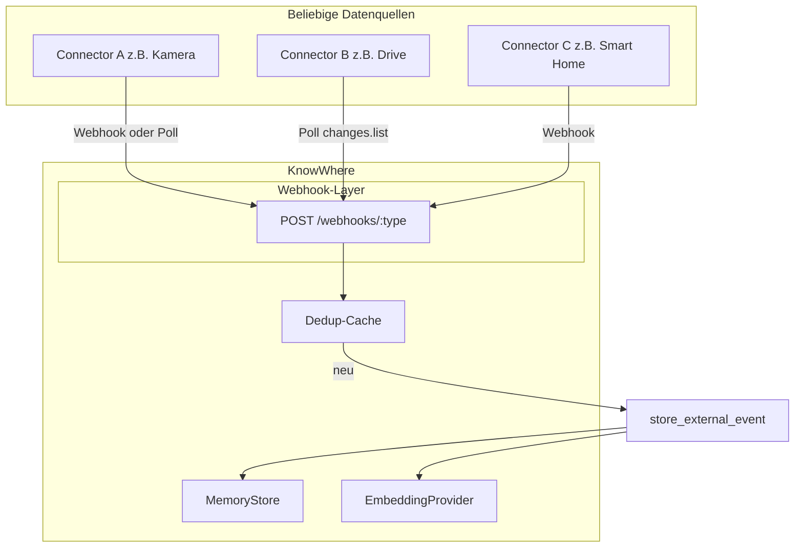

# Phase 2: Connectors — Optimierter Plan (3 Meilensteine)

## Ziel und Philosophie

**Kontext aus allen Informationsquellen.** KnowWhere soll beliebige externe Datenquellen (Kamera, Drive, Smart Home, Sensoren, …) anbinden können, um einen einheitlichen Kontext für alle Agenten zu liefern. Es geht nicht um einen einzelnen „wichtigsten“ Connector, sondern um ein **Connector-Pattern**: Webhooks oder Polling → Pointer + Metadaten → Store → Retrieval. Frigate, Google Drive und Home Assistant sind **Beispiele** für dieses Pattern; weitere Connector-Typen folgen nach dem gleichen Muster.

- **Pointer-First:** Keine Rohdaten speichern, nur Pointer + Embedding + Metadaten.
- **Deduplizierung & Sicherheit** von Anfang an (Secret pro Webhook, Event-Cache).
- **Kein Over-Engineering:** Drive zunächst nur Polling (Push wenn öffentliche URL da ist); Cross-Modal optional (Phase 3 wenn nötig).

---

## Architektur (beliebige Connector-Quellen)

---

## Meilenstein 1: Webhook-Infrastruktur + erster Connector (Woche 1)

**Ziel:** Einheitliche Basis für **alle** zukünftigen Connector-Webhooks; ein konkreter Webhook als Referenz (Frigate als Beispiel, nicht als Priorität).

- **Neue Route:** `POST /webhooks/frigate` (öffentlich erreichbar, **nur mit Secret**).
- **Gemeinsam für alle Webhooks:**
  - **Sicherheit:** Webhook-Secret pro Typ (Header `X-Webhook-Secret` oder Query). Fehlt/ falsch → 401/403, kein Event speichern.
  - **Deduplizierung:** In-Memory-Cache (z. B. letzte 1000 Event-IDs/Pointer, TTL 24h); konfigurierbare Größe/TTL (Const oder ENV). Bei Hit → 200 OK, kein Insert.
- **Frigate-Payload:** EventResponse parsen (id, camera, label, has_snapshot, …) → `ExternalEvent` (pointer `frigate://{base_url}/api/events/{id}/snapshot`, metadata) → Dedup → `store_external_event`.
- **ENV:** `FRIGATE_WEBHOOK_SECRET`, `FRIGATE_BASE_URL` (oder bestehendes `FRIGATE_URL`).
- **OpenAPI** für `/webhooks/frigate` + **Integration-Test:** ohne Secret → 401; mit Secret + gültigem Payload → 200, Node im Store.

Bestehender Frigate-Poller in [src/main.rs](src/main.rs) bleibt als Fallback; Dedup verhindert Doppelungen.

---

## Meilenstein 2: Google Drive Polling + Admin Full-Dream (Woche 1–2)

- **Google Drive Connector (nur Polling):**
  - Echte Anbindung an Drive API v3: **changes.list** mit `pageToken` (kein Push in Phase 2).
  - Pointer: `gdrive://file/{fileId}`; Metadaten: name, mimeType, modifiedTime.
  - ENV: `GOOGLE_DRIVE_REFRESH_TOKEN` + `GOOGLE_CLIENT_ID` + `GOOGLE_CLIENT_SECRET` (oder Service Account). Token-Refresh bei 401; bei 429/Fehler: Exponential Backoff, optional Circuit-Breaker (Poller pausiert X Min).
  - Deduplizierung für Drive-Events (gleicher Cache wie M1, Key = Pointer oder changeId).
- **Admin-Endpoint:** `POST /dream/full` (geschützt, gleicher Auth-Layer wie andere Routen). Handler ruft `state.dream.full_dream().await` auf; Response z. B. `{ "ok": true, "clusters_created": N }`. **Timeout** (z. B. 5 Min) oder Hinweis in Doku (O(n²)). OpenAPI eintragen.

---

## Meilenstein 3: Home Assistant + Cross-Modal optional (Woche 2)

- **POST /webhooks/homeassistant:** Einfaches JSON (z. B. entity_id, state, attributes, last_changed). Pointer: `ha://entity/{entity_id}`; Metadata + Text-Embedding aus State/Attributes. Dedup (entity_id + last_changed). ENV: `HA_WEBHOOK_SECRET`.
- **Cross-Modal:** Placeholder bleibt **Default**. Echte Bild-/Audio-Embedding nur wenn gewünscht (später/Phase 3); in M3 nur vorbereiten (Trait/AppState-Platz, Fallback auf Text-Embedding des Pointers).

---

## Eventualitäten & Sicherheit (kurz)

| Risiko                           | Maßnahme                                                                                                              |
| -------------------------------- | --------------------------------------------------------------------------------------------------------------------- |
| Externe API down                 | Log, Retry mit Backoff; optional Circuit-Breaker (Poller pausieren). Webhook: 200 akzeptieren oder verwerfen mit Log. |
| Token abgelaufen (Drive)         | Refresh bei 401; bei Fehler Pause, Log, Retry.                                                                        |
| Webhook-Secret fehlt/falsch      | 401/403, kein Event speichern.                                                                                        |
| Doppelte Events                  | Dedup-Cache (Event-ID/Pointer, TTL); optional später persistenter Check.                                              |
| Große Payloads                   | Body-Limit (z. B. 1 MB); nur Pointer, nie Rohdaten.                                                                   |
| Full-Dream O(n²)                 | Timeout oder Doku-Hinweis.                                                                                            |
| Cross-Modal URL nicht erreichbar | Fallback Text-Embedding des Pointers.                                                                                 |

---

## Abhängigkeiten & ENV

- **Crates:** Für Drive: `reqwest` (bereits da) + OAuth2 (z. B. `yup-oauth2`) oder Service-Account-JSON.
- **ENV:** `FRIGATE_WEBHOOK_SECRET`, `FRIGATE_BASE_URL`; `GOOGLE_DRIVE_REFRESH_TOKEN`, `GOOGLE_CLIENT_ID`, `GOOGLE_CLIENT_SECRET`; `HA_WEBHOOK_SECRET`. Optional später: `CROSS_MODAL_PROVIDER`.

---

## Tests

- **M1:** Integration: `POST /webhooks/frigate` ohne Secret → 401; mit Secret + gültigem Payload → 200, Node in Store.
- **M2:** `POST /dream/full` mit Auth → 200; Drive-Connector Unit-Test mit Mock-API-Response.
- **M3:** `POST /webhooks/homeassistant` mit Minimal-Payload → 200, Node mit ha-Pointer.

---

## Roadmap-Anschluss

- Nach Woche 5 (Beta-Ready) → **Phase 2** (dieser Plan).
- Danach: Woche 6 = 3. Agent + Frontend-Test-Agent; Woche 7 = Deployment / erste Beta-User.
- **Drive-Push** (changes.watch) und **echter Cross-Modal-Embedder** in Phase 3, wenn öffentliche URL bzw. Bedarf für Bild/Audio-Suche besteht.

---

## Dokumentation

- [docs/ARCHITECTURE.md](docs/ARCHITECTURE.md): Webhook-Layer, Connector-Pattern, Dedup.
- [README.md](README.md): Setup Webhooks, ENV-Variablen, Beispiel-Konfiguration pro Connector-Typ.
